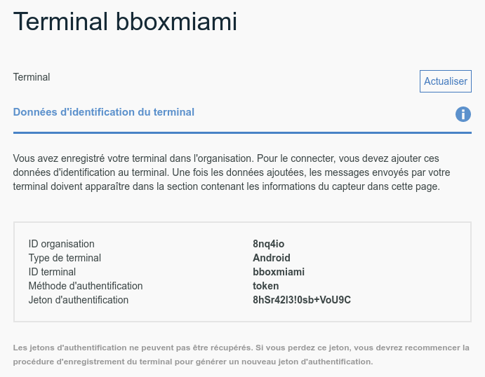

# BboxApi-Bluemix Notification bridge

[](https://travis-ci.org/BboxLab/bboxapi-bluemix-starterkit)
[](LICENSE.md)

Android Service running a MQTT notification client between BboxApi and Bluemix platform


Following BboxApi notifications are published through MQTT client directly to Bluemix IoT platform : 


| notification types | MQTT Topic |
|--------------------|-------------------|
| APPLICATION         |  "Application" |
| MEDIA     |     "Media"       |
| MESSAGE |     Message         |
| USER_INPUT   |   "UserInterface/RemoteController"      |
| IOT        |    "Iot"    |

## Download source

```
git clone bboxapi-bluemix-starterkit
```

## Setup Bluemix

The following will describe how to create a working IoT Bluemix project step by step from https://console.eu-gb.bluemix.net :

<hr/>

<b>1) Create a Bluemix account</b>


<hr/>

<b>2) Deploy this Git project in your Bluemix and choose your region/organization/space</b>

[](https://bluemix.net/deploy?repository=https://github.com/edevregille/node-red-bluemix-starter.git)


<hr/>

<b>3) Go to your Dashboard and select "iot-foundation" : </b>


<hr/>

<b>4) Then, select "launch dashboard" : </b>


<hr/>

<b>5) Go to "devices" and click on "add a device" :</b>


<hr/>

<b>6) You can't create a device if you havent created device type yet, click on "create a device type" :</b>


<hr/>

<b>7) Create a device with type "Android" and define your "model" :</b>


<hr/>

<b>8) Now add a device with type "Android" : </b>


<hr/>

<b>9) Don't forget to save somewhere identification data for your device </b>


<hr/>


## Configure authentication variables

* In your `./bbox-bluemix-bridge/build.gradle` you have a few variables to set :

| environnement variable | description |
|--------------------|-------------------|
| BBOXAPI_APP_ID         | application ID relative to your Miami Box  |
| BBOXAPI_APP_SECRET     | application Secret relative to your Miami Box             |
| BLUEMIX_IOT_DEVICE_TYPE | Bluemix Internet of Things auth token (see last step in Setup)              |
| BLUEMIX_IOT_DEVICEID   | Bluemix Internet of Things deviceId you have set              |
| BLUEMIX_IOT_ORG        | Bluemix Internet of Things organization id (at the top in dashboard page)        |
| BBOXAPI_API_KEY        | In dashboard -> global variables  |
| BBOXAPI_API_TOKEN      | In dashboard -> global variables             |

You can either set these variable as environnement variable or you can replace them with their values directly

* `BBOXAPI_APP_ID` and `BBOXAPI_APP_SECRET` are given by Bouygues Telecom. If you dont have these, here is following contact https://dev.bouyguestelecom.fr/dev/?page_id=51


* Do the same modifications in `./bbox-bluemix-mobile/build.gradle`


## Build Android app

Build project (bridge and mobile) with Android Studio or your favorite IDE

## Install mobile Android application

Connect via adb or USB and install apk :  

```
adb connect <IP>
adb install -r ./bbox-bluemix-mobile/build/outputs/apk/bbox-bluemix-mobile-debug.apk
```

## Install Service on Bbox Miami

Note down your Bbox Miami <IP> address.
Connect via adb and install apk :  

```
adb connect <IP>
adb install -r ./bbox-bluemix-bridge/build/outputs/apk/bbox-bluemix-bridge-debug.apk
```

## Launch Service

```
adb shell am startservice  "fr.bouyguestelecom.tv.bridge.bluemix/.BluemixBridgeService" --user 0
```

## Output screenshot

* Client output, publishing message with BBoxApi Notification topic to Bluemix platform


<hr/>

* Bluemix Node Red Dashboard receiving notifications


<i>You can access Node Red dashboard from your <service_url>/red. For instance : http://yourservice.mybluemix.net/red/</i>

<hr/>

## Modify source code dispatching notification

Android application is a service defined in `fr.bouyguestelecom.tv.bridge.bluemix.BluemixBridgeService.java` :


## External Libraries

* <a href="https://github.com/ibm-messaging/iot-starter-for-android">IBM IoT Starter for Android</a>
* <a href="https://github.com/BboxLab/bbox-2ndscreen-android">bbox-2ndscreen library</a>
* <a href="http://www.eclipse.org/paho/">Eclipse Paho MQTT open source client</a>
* <a href="https://github.com/edevregille/node-red-bluemix-starter.git">Node Red Bluemix Starter by edevregille</a>


## License

The MIT License (MIT) Copyright (c) 2016 InnovationLab BboxLab

